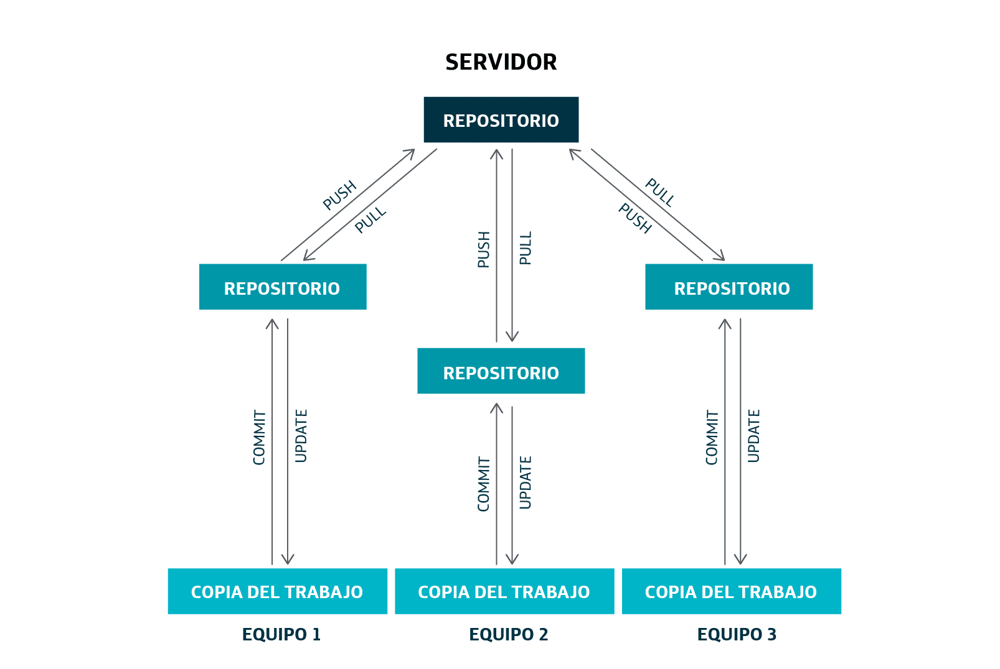
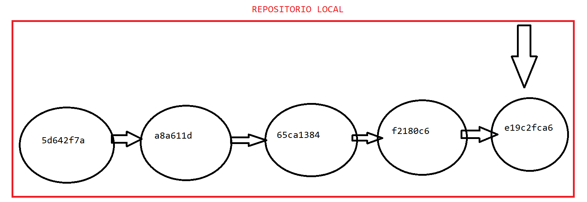
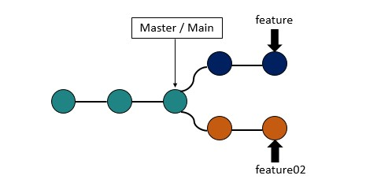
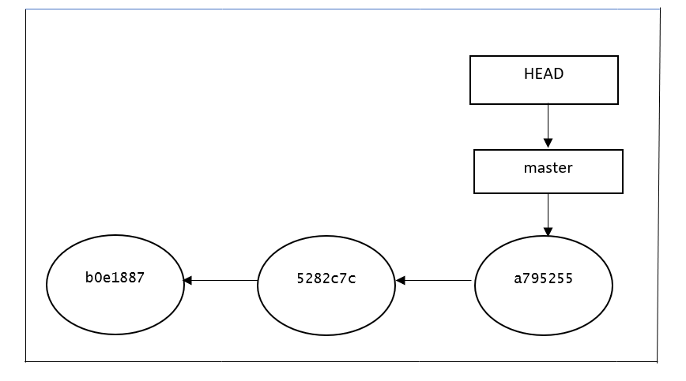
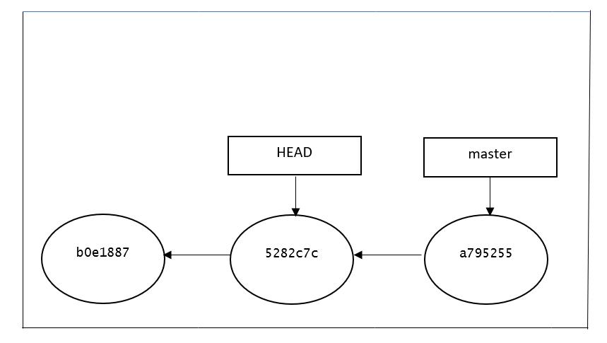
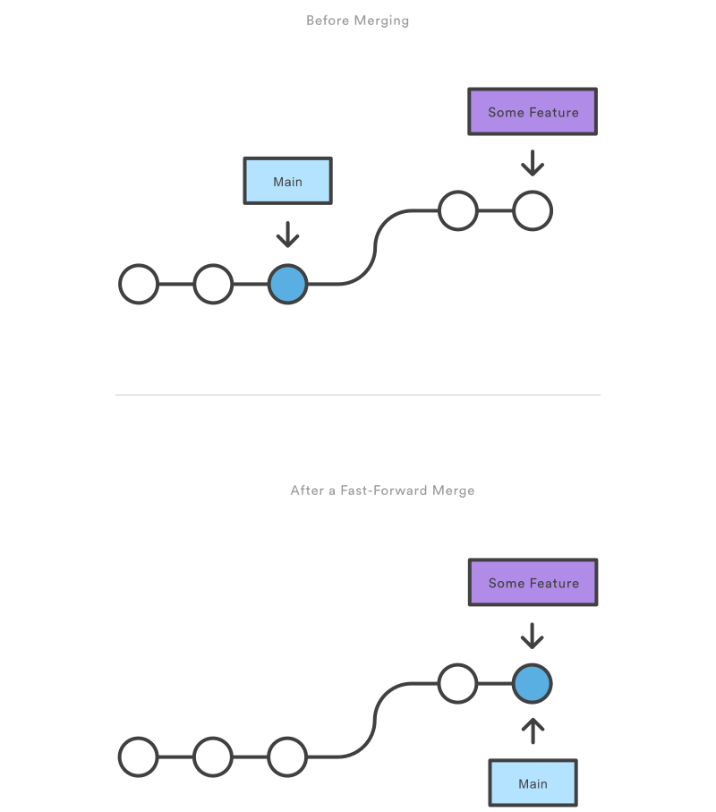
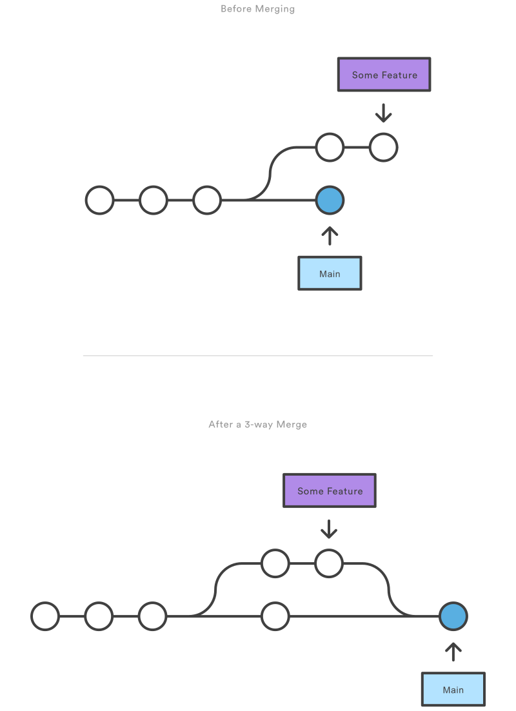

# GIT

## Introducci&oacute;n

Los sistemas de gestión de versiones de código fuente son herramientas que nos permiten trabajar en equipo en el desarrollo software y mantener un histórico de versiones del proyecto en el que se trabaja.

<b>Git</b> es un software de control de versiones diseñado por **Linus Torvalds**, pensando en la eficiencia, la confiabilidad y compatibilidad del mantenimiento de versiones de aplicaciones cuando estas tienen un gran número de archivos de código fuente. Su propósito es llevar registro de los cambios en archivos de computadora incluyendo coordinar el trabajo que varias personas realizan sobre archivos compartidos en un repositorio de código.

## Caracter&iacute;sticas m&aacute;s importantes

1. Gestión distribuida. Los programadores tendrán un repositorio local con el que trabajar y un repositorio remoto en el que se compartirán los cambios. Los programadores tendrán copias del repositorio remoto en el repositorio local. Estos aportan 2 grandes ventajas:

    - Puedes seguir trabajando, aunque el repositorio remoto esté caído
    - La información está más replicada.

2. Libre y de código abierto. Git es un software libre bajo la licencia de código abierto GPL. Además de estar disponible libremente en Internet, Git puede ser usado sin tener que pagar. El código puede ser descargado y modificado si es necesario.

3. Rápido y pequeño. Git no se basa en un servidor central, por eso no hay necesidad de interactuar con el servidor remoto para cada operación. Además, está construido en lenguaje C y es muy liviano.

4. Ramificación sencilla. Una rama es un flujo de trabajo y sirven para hacer desarrollos
paralelos a nuestro trabajo principal. Las ramas en un repositorio Git se manejas de una forma sencilla comparadas con otros sistemas de control de versiones.

## Descarga e instalaci&oacute;n

Lo primero que tenemos que hacer es descargar **Git** en nuestro ordenador e instalarlo. Esto varía en función del sistema operativo. Podemos descargarlo a partir del siguiente enlace [https://git-scm.com/downloads](https://git-scm.com/downloads).

Para instalarlo podemos elegir la configuración por defecto que se nos muestra en el instalador.

Una vez instalado, podemos ejecutar el siguiente comando en una terminal para verificar la instalación y ver la versión de GIT que estamos usando en nuestro ordenador.

    git --version

Git se puede trabajar perfectamente con una terminal o línea de comandos, aunque también es posible usar con algunas herramientas graficas.

## Flujo de trabajo

Es muy importante entender el flujo de trabajo de Git para poder trabajar con él. Tenemos 3 secciones de trabajo (también llamados arboles) dentro de un proyecto Git, a la que podremos añadirle una cuarta en caso de que queramos trabajar de manera colaborativa (siendo opcional).

1. **Directorio de trabajo o WorkSpace**. La carpeta que contiene los ficheros con los que vamos a trabajar. Estos archivos se sacan de la base de datos comprimida en el repositorio local, y se colocan en disco para que los puedas usar o modificar.
2. **Stage, area de preparación o Index**. Zona intermedia entre el workspace y el repositorio local. Es aquí donde vamos a poner los ficheros que están en nuestro workspace que queremos versionar en nuestra próxima confirmación.
3. **Repositorio local o directorio de Git**. Es donde se almacenan los metadatos y la base de datos de tu proyecto. Es la parte más importante de Git, y es lo que se copia cuando clonas un repositorio remoto.
4. **Repositorio remoto**. El concepto es prácticamente igual que el de repositorio local, pero es donde se persistirá la información de todos los repositorios locales de nuestro proyecto.

En la siguiente imagen podemos ver estas secciones

Un flujo de trabajo básico en Git sería:

1. Modificas una serie de archivos en tu directorio de trabajo.
2. Preparas los archivos, añadiéndolos a tu área de preparación (stage).
3. Confirmas los cambios, lo que toma los archivos tal y como están en el stage y almacena esa copia instantánea de manera permanente en tu directorio de Git o repositorio local.
4. (Opcional) Subimos los cambios de nuestro repositorio local a nuestro repositorio remoto.

## Configuración inicial

Debemos de configurar nuestro GIT con nuestro nombre de usuario y nuestro email

~~~
git config --global user.name "NOMBRE QUE USAREMOS PARA MOSTRAR EN GIT"
~~~

~~~
git config --global user.email "correo@electronico.es"
~~~

## Creación del directorio de trabajo o workspace

Una vez instalado y configurado nuestro Git debemos de crear el workspace donde queremos trabajar, pudiendo ser un directorio vacío o un workspace de algún IDE como Eclipse.

Una vez creado dicho workspace debemos de abrir una terminal de o ventana de comandos para empezar a ejecutar los comandos Git.

En nuestro caso, este workspace esta creado con Eclipse, pero podríamos haber usado cualquier IDE.

## Comandos básicos

1. Para crear un repositorio local GIT debemos de usar el siguiente comando en un workspace
 
        git init
    
    Este comando nos creara una carpeta oculta llamada <b>.git</b>. Dentro de esta carpeta estará nuestro repositorio local de GIT

    En caso de que queramos eliminar nuestro repositorio local, simplemente borraremos la carpeta <b>.git</b>

2. Para ver el estado de nuestro espacio de trabajo podemos usar el comando

        git status

    Que nos dará información sobre el estado de nuestras secciones, por ejemplo, que archivos tenemos en el <b>stage</b> y cuáles no, o que archivos tenemos pendientes de hacer un commit. Es un comando muy usado.

3. Para añadir ficheros al <b>stage</B>

        git add nombre_fichero

    También podemos añadir todos los ficheros al stage de una manera más cómoda sustituyendo el nombre del fichero por un punto.

            git add .

    Para quitar ficheros del <b>stage</b> 

        git restore --staged NOMBRE_FICHERO

4. Para versionar los cambios que están en el stage

        git commit
    
    Todos los commits que se hagan deben tener un mensaje, por lo tanto, es más común utilizar el comando

        git commit -m "DESCRIPCION DEL COMMIT"
    
    Todos los commits están asociados a un usuario con un correo.

5. Podemos ver todo nuestro historial de cambios con el comando
    
        git log
    
    Que nos sacaría algo parecido a este mensaje:

        commit 5d642f7a2350ee19dc13bc2de94a96005c635ab1
        Author: Felix de Pablo <f.depablo.lobo@gmail.com>
        Date:   Sun Jan 23 21:35:52 2022 +0100

            Primer commit del proyecto

    Donde podemos ver el mensaje hash del commit (un identificador único del commit), el autor que ha realizado el commit, la fecha en la que realizo el commit y el mensaje con el que se hizo el commit.

    <b>git log</b> nos saca todos los commits realizados, si pulsamos las flechas arriba y abajo de nuestro teclado podemos ir viendo el histórico. Si queremos cerrar el log debemos de pulsar la tecla <b>q</b>

6. Podemos ver los cambios de nuestro repositorio local con nuestro workspace con el comando
    
        git diff

7. Podemos eliminar los cambios nuevos de nuestro workspace con el comando 

        git restore NOMBRE_FICHERO 
    
    O si queremos eliminar todos los cambios:

        git restore .

8. Podemos ir a cualquier commit a ver la "foto" o estado de nuestro proyecto. Para ello usaremos el comando

        git checkout MENSAJE_HASH

    No hace falta poner todo el mensaje hash, con poner los primero caracteres es suficiente.

        git checkout 5d642f7a2350ee19dc13bc2de94a96005c635ab1
        git checkout 5d642f7

    De esta manera, <b>el workspace entero cambiara al estado en el que estaba el proyecto en el commit al que estamos apuntando</b>. Por supuesto, los demás commits no se perderán, por lo que podremos regresar en el momento que queramos. Podremos entender que nuestro repositorio local tiene registrados todos los commits de nuestro proyecto.

9. Cuando estamos en otro commit podemos usar el comando

        git log --all

    Con este comando podemos ver todos los commits del proyecto, ya que por defecto, el comando <b>git log</b> solo te muestra desde el commit al que estes apuntando hacia atrás en el tiempo.

10. Para regresar al último commit de nuestra rama principal

        git checkout master

Tenemos que entender que por cada **commit** que hagamos sobre nuestro proyecto se nos persistirá el estado de nuestro proyecto en ese instante. Además, cada commit está apuntando al siguiente commit que se hizo después, teniendo una foto parecida a la siguiente.

11. Si queremos ver el detalle de los cambios que hicimos en un commit podemos usar el comando

        git show MENSAJE_HASH

12. Podemos unir el comando "add" y el comando "commit" en una sola sentencia.

        git commit -am "DESCRIPCION DEL COMMIT"

**¡Ojo con este comando!** Solo vale para cambios sobre ficheros o carpetas ya versionados. En caso de que tengamos ficheros o carpetas nuevos, hay que hacer primero un **git add** de los ficheros o carpetas en cuestión.

## Ramas

### Concepto de rama o branch

Una **rama o “branch”** se crea para ejecutar una nueva línea de desarrollo o versión. Git tiene una rama principal llamada **master** o **main** dependiendo de la versión. Antiguamente la rama principal se llamaba **master** pero con la llegada del lenguaje inclusivo se cambió a **main**. Podemos encontrarla de ambas maneras, pero en esta guía vamos a referirnos a la rama principal como **master** ya que actualmente es el más común.

Las **ramas** en git son simplemente punteros o referencias que apuntan a un commit. La idea es muy similar a las referencias de POO (como Java), las ramas serían equivalentes a las referencias y los commits serían equivalentes a los objetos. Los commits guardan los diferentes estados de nuestro repositorio mientras que las ramas apuntan a dichos commits.

### Concepto de HEAD

Entender el concepto de **HEAD** es fundamental para poder trabajar en Git con ramas. **HEAD** es una referencia o puntero a la rama donde te encuentras en cada momento (que a su vez la rama apunta a un commit). Además, a donde este apuntando el HEAD, <b>será el commit con el que estamos trabajando</b>. 

Por defecto el puntero HEAD está apuntando a la rama **master**, aunque también podemos hacer que apunte directamente a un commit tal y como vimos con el comando **git checkout**. Es decir, cuando hacemos un **git checkout** a un commit, realmente lo que estamos es **moviendo el puntero HEAD a ese commit**.

Siempre que hagamos commit en una rama a la que estamos apuntando con HEAD, la rama y el HEAD avanzará automáticamente hasta el nuevo commit que hayamos hecho.

### Estado "detached HEAD"

Hay que tener cuidado cuando apuntamos a un commit directamente en vez de a una rama con el puntero HEAD, ya que no es su estado ideal. Siempre que apuntemos a un commit directamente con el comando **checkout** estaremos en estado **detached** y git nos mostrará un mensaje como el siguiente

    You are in 'detached HEAD' state. You can look around, make experimental changes and commit them, and you can discard any commits you make in this state without impacting any branches by switching back to a branch.

En este estado podemos hacer cambios o pruebas, pero NO podemos hacer commits de los cambios que hagamos. Si queremos hacer commits en un estado **"detached"** debemos crear otra rama en ese commit y apuntar con HEAD a dicha rama.

Siempre que hagamos cambios en un estado **"detached"** tenemos dos opciones:

1. Eliminar los cambios hechos con el comando **git restore** y volver a la rama donde estábamos trabajando con el comando **git checkout NOMBRE_RAMA**. Esto suele ser lo normal en caso de que hayamos ido a un commit simplemente para hacer pruebas, pero no versionarlas.
2. Persistir los cambios, para ello debemos de crear una rama nueva hacer un commit. Esto se suele hacer si queremos ir a un estado del proyecto del cual queremos partir para hacer un desarrollo nuevo.

### Trabajando con ramas en Git

Vamos a ver los comandos más importantes para trabajar con ramas.

1. Podemos crear ramas con los siguientes comandos

        git checkout -b NOMBRE_DE_LA_RAMA
        git branch NOMBRE_DE_LA_RAMA

    Con la primera opción, crea la rama y nos cambia a dicha rama. Con la segunda opción, solamente la crea, pero permanecemos en la actual.

2. Podemos ver las ramas que tenemos con el comando 

        git branch

3. Para borrar una rama

        git branch -d NOMBRE_DE_LA_RAMA

    Nótese que solo borramos la rama, es decir, la referencia. Los commits permanecen en el repositorio.

4. Git cuenta de una herramienta visual para poder ver los commit y ramas que tenemos, podemos abrirla usando el siguiente comando

        gitk
    
    Por defecto, el comando **gitk** muestra desde commit donde estemos hacia atrás en el tiempo (como el comando **log**). Si queremos mostrar todos los commits y ramas usaremos el comando

        gitk --all

    También podemos verlo de manera similar en la consola mediante el comando

        git log --graph --abbrev-commit --decorate --all
		
5. Por último, podemos cambiar entre ramas con cualquiera de los siguientes comandos

        git checkout NOMBRE_DE_LA_RAMA
        git switch NOMBRE_DE_LA_RAMA

### Fusionando ramas en Git

Cuando creamos ramas en un proyecto Git, nuestro historial sufre bifurcaciones, siendo cada una de esas ramas desarrollos paralelos, pero también es posible que cuando acabemos un desarrollo de una rama, queramos fusionarla con la rama principal o con otra rama.

La fusión es la forma que tiene Git de volver a unir un historial bifurcado, comúnmente llamado **merge** o fusión. El comando **git merge** permite tomar las líneas independientes de desarrollo creadas e integrarlas en una sola rama.

Podemos fusionar ramas posicionándonos en la rama donde queremos hacer la fusión y ejecutando el comando

        git merge RAMA_QUE_QUEREMOS_FUSIONAR
        
Por ejemplo, si hemos creado una rama llamada "desarrollo1" y después de varios commit sobre esa rama, hemos concluido el desarrollo que estábamos buscando, podemos irnos a la rama master y ejecutar <b>git merge desarrollo1</b>.

Antes de seguir, tenemos que entender el concepto de <b>conflicto</b>. Un conflicto en Git se producirá si las dos ramas que tratas de fusionar han cambiado la misma parte del mismo archivo, ya que Git no podrá averiguar qué versión utilizar. Siempre que haya un conflicto habrá que solucionarlo a mano.

Cuando hagamos una fusión entre ramas, Git va a intentar siempre juntar los cambios de manera automática, pero aquí pueden ocurrir varios casos, los más importantes:

1. <b>Fusión con avance rápido</b>. Cuando queremos fusionar la rama A con la rama B, pero en la rama B no hemos hecho ningún commit (solo hemos hecho commits en la rama A). En este caso se avanzará la rama B hasta la rama A (recordemos que las ramas son punteros). No se creará ningún commit nuevo ni habrá conflictos.

2. <b>Fusión de tres vías SIN conflicto</b>. Cuando queremos fusionar la rama A con la rama B habiendo hecho commits en ambas ramas, pero sin conflictos entre ellas. En este caso, **Git hará un commit nuevo de manera automática**, uniendo todos los cambios de ambas ramas.

<b>¡IMPORTANTE!</b> Nótese que tras hacer este tipo de fusión, la rama A <b>se queda atras</b> respecto a la rama B (SomeFeature vs main, en la foto). Si queremos que ambas ramas apunten al mismo commit (por ejemplo, para seguir desarrollando en la rama someFeature), debemos de ir a la rama B y fusionar con la rama A y así hacer una fusión con avance rápido.

3. <b>Fusión de tres vías CON conflicto</b>. Cuando queremos fusionar la rama A con la rama B habiendo hecho commits en ambas ramas, pero con conflictos entre ellas. En este caso, Git unirá ambos ramas y marcará aquellos ficheros que han dado conflicto. **Git no creará ningún commit nuevo de manera automática** y se deberán de editar los ficheros para hacer la fusión a mano. Una vez resulto el conflicto, se deberá hacer un commit con el resultado fusionado.

## Etiquetar commits (Tag)

En Git podemos etiquetar commits para tenerlos localizados siempre que queramos. Una **etiqueta o tag** en Git es una rama que permanece inalterada, es decir, siempre apuntará a un mismo commit.

Los tags pueden ser muy útiles para marcar hitos de progreso o versiones importantes en nuestro proyecto.

Para etiquetar un commit primero nos posicionaremos en dicho commit, a continuación, ejecutaremos el comando

    git tag VERSION

Una vez creada la etiqueta, podemos usarlas para volver al estado del repositorio que marcan 

    git checkout VERSION

## Fichero .gitignore

Por defecto, Git intentará versionar todos los ficheros que tengamos en nuestro espacio de trabajo, pero podemos evitar dicho comportamiento creando un fichero **.gitignore** en nuestro workspace.

Dentro de un fichero </b>.gitignore</b> podemos poner todos los nombres de los ficheros que queremos que sean ignorados por Git a la hora de versionar. Serian como si no existieran para Git. Este fichero normalmente lo crearemos a mano, es un fichero que **no tiene nombre** y cuya extensión es **.gitignore**

**NOTA:** Windows por defecto oculta las extensiones de los ficheros. Para crear un fichero **.gitignore** debemos de tener habilitadas las extensiones y de esta manera, cambiar la extensión del mismo. Si hemos creado bien el fichero, el tipo de fichero nos aparecerá en Windows como **GITIGNORE**

Tenemos muchas reglas para formar el fichero, las más importantes:

1. Por cada línea ponemos un archivo, directorio o un patrón para ignorar. Ejemplo:
    - **prueba.doc** NO versionamos dicho fichero.
2. Los comentarios empiezan por **#**
3. Con el carácter <b>*</b> expresamos que son todos los ficheros, por ejemplo:
    - <b>*.txt</b> NO versionamos los ficheros que tengan extensión **.txt**
    - <b>entornos.*</b> NO versionamos los ficheros que se llamen entornos sea cual sea su extensión.
4. Podemos hacer excepciones a las reglas anteriores. Los fichero que empiecen con el carácter **!** haremos dicha excepción y Git **SI** que los versionara. Ejemplo:
    - Si ponemos en una línea <b>.txt</b> y en otra línea **!importante.txt**, Git NO versionará ningún fichero con extensión **.txt** a excepción del fichero **importante.txt** 

El fichero **.gitignore** lo podemos poner donde queramos dentro de nuestro espacio de trabajo, incluso podemos tener varios. Git buscara ficheros **.gitignore** por todas las carpetas y subcarpetas de nuestro workspace.

En este workspace se ha creado un **.gitignore** para trabajar con proyectos java, ignorando todo aquello que no tiene que ver con el código o las configuraciones de los proyectos (como por ejemplo, los metadatos de Eclipse).

**IMPORTANTE:** El fichero **.gitignore** se debe crear **antes del primer commit** para que funcione correctamente (después de hacer el 'git init'). Si agregamos el fichero más adelante, los ficheros que se hayan versionado no se dejaran de versionar.

## GitHub

GitHub es una plataforma de desarrollo colaborativo para alojar proyectos utilizando el sistema de control de versiones Git. Suele hacer funciones de <b>repositorio remoto</b> y con el paso del tiempo ha ido cogiendo características de las redes sociales. Es el “Instagram” del código fuente.

Para utilizar Gihub lo primero que debemos de hacer es una cuenta es su [página](https://github.com/). Es gratuita por lo que no debemos de pagar nada.

Una vez nos hayamos hecho la cuenta ya podemos empezar a enlazar nuestros repositorios locales Github. Normalmente cuando creamos un repositorio en Github nos da una serie de instrucciones para hacerlo, en ese sentido, Github es bastante intuitivo de usar y da muchas ayudas.

### Concepto de "origin"

<b>origin</b> es el nombre predeterminado que recibe el repositorio remoto principal contra el que trabajamos. Cuando clonamos un repositorio por primera vez desde GitHub o cualquier otro sistema remoto, el nombre que se le da a ese repositorio "maestro" es <b>origin</b>. Aunque se puede cambiar, no es habitual hacerlo ya que es el convenio que marca Git. 

### Trabajando con Github

Una vez creado nuestro repositorio en Github debemos de enlazarlo con nuestro repositorio local, para ello usaremos el comando

    git remote add origin URL_REPOSITORIO_GITHUB
	
Para subir cambios de nuestro repositorio local a nuestro repositorio remoto usaremos el comando
    
    git push origin master

Donde **push** es el comando para subir el contenido, **origin** es el repositorio destino y **master** es la rama que queremos subir. Al repositorio remoto NO subiremos todas nuestras ramas por defecto, solo subiremos la que le digamos.

Como es muy frecuente subir cambios al repositorio remoto podemos añadir <b>-u</b> para que recuerde que el comando <b>push</b> por defecto lo haga de master a origin

    git push -u origin master

De esta manera, a partir de este momento podremos hacer simplemente

    git push

Una vez conectado al nuestro repositorio remoto y hecho el primer **push** podemos empezar a trabajar de manera colaborativa con otras personas o incluso nosotros mismo con otros ordenadores que tengamos.

Lo primero que hay que hacer es una clonación del repositorio desde el ordenador que queramos

    git clone DIRECCION_REPOSITORIO_GITHUB

Este comando ejecuta implícitamente los siguientes

    mkdir NOMBRE_DEL_REPOSITORIO_REMOTO
    git init
    git remote add origin DIRECCION_REPOSITORIO_GITHUB
    git pull

Por lo que nos facilita mucho el trabajo de creación del repositorio local y de unirlo con el repositorio remoto.

En Gihub, si tenemos nuestro workspace configurado como público (por defecto), cualquier persona podrá hacer un <b>clone</b> de nuestro proyecto, pero **NO** podrán hacer **push** a menos que demos los permisos en Github para hacerlo. Para ello, debemos de ir a la parte de **"settings"** del workspace que queremos compartir y añadir el usuario en **"manage access"**. El usuario debe de tener una cuenta Github.

Una vez que tengamos clonado o enlazado el repositorio remoto podemos decirle a Git que nos actualice nuestro repositorio local con los cambios del repositorio remoto, además de actualizarnos el workspace. Para ello ejecutaremos el comando

    git pull

¡Cuidado!, podría dar conflictos que deberíamos de solucionar.

## Buenas prácticas para el trabajo colaborativo

Git puede llegar a ser complicado de trabajar en algunos casos, sobre todo a la hora de resolver conflictos entre diferentes integrantes de un grupo de trabajo. En este apartado vamos a hablar sobre buenas prácticas para evitar problemas cuando trabajamos dentro de un equipo.

Para empezar, los integrantes de un equipo deberían de evitar trabajar directamente con la rama principal de la aplicación (master o main). Es una mejor opción que cada integrante se cree una rama para hacer sus desarrollos (puede ser con su nombre, por ejemplo), y siempre intente trabajar con dicha rama.

Una vez tenga su desarrollo hecho o cuando estime oportuno, puede ir fusionando los cambios con la rama principal para luego subir estos cambios al repositorio remoto.

Podríamos resumirlo en los siguientes pasos:

0. Cada integrante se crea su repositorio local y lo sincroniza con el repositorio remoto.

1. Cada integrante del equipo se crea un propia rama local, para desarrollar sobre ella.

        git checkout -b tony_stark

2. Cada integrante comienza su trabajo de desarrollo, haciendo los commits que considere necesario

        git add .
        git commit -m "descripción del cambio"

3. Una vez hayamos acabado de hacer el desarrollo nos cambiamos a la rama master y nos bajamos los posibles cambios que hayan hecho nuestros compañeros.
    
        git checkout master
        git pull

4. Fusionamos la rama master con nuestra rama de desarrollo

        git merge tony_stark
    
5. Solucionamos los posibles conflictos (Si procede). Esto puede llevar a editar a mano ciertos ficheros y a crear nuevos commits con los cambios.

6. Subir los cambios al repositorio remoto

        git push origin master
    
7. Si queremos continuar con los desarrollos de nuestra rama, debemos de fusionar la rama master con la rama de desarrollo para que ambas ramas apunten al mismo commit. Esto solo es necesario si hemos hecho una fusión de tres vías, aunque no habría problema en hacerlo si es una fusión de avance rápido. Ver [Fusionando ramas en Git](#fusionando-ramas-en-git) para más información.

        git checkout tony_stark    
        git merge master
    
8. (Optativo). Podríamos subir nuestra rama de desarrollo a **origin** para que otros integrantes puedan verla o incluso trabajar con ella. 
    
        git push origin tony_stark

    Para bajarse la rama, los demás integrantes deberán ejecutar el siguiente comando

        git pull origin tony_stark

    Con el anterior comando nos bajaremos la rama, pero en nuestro git estará como **remota**, es decir, el nombre de la rama será **origin/tony_stark**, y hay es posible que no la veamos a simple visa, ya que por defecto el comando **git branch** solo muestra las ramas locales. Si queremos mostrar tanto las ramas locales como remotas debemos de ejecutar el siguiente comando

        git branch --all

    **Nota:** Todas las ramas que empiezan por **origin** son ramas remotas.

    Si queremos convertir una rama remota en una rama local para poder trabajar con ella, simplemente nos cambiaremos a ella y se nos creara dicha rama local

        git checkout tony_stark

    Podemos encontrar más información en el siguiente enlace [Trabajando con ramas remotas y locales](https://medium.com/@mario_gl/git-bajar-todas-las-nuevas-ramas-del-repositorio-remoto-ff02077a9251)
## Fork en Github

Otra manera de trabajar colaborativamente en Github, es hacer un <b>fork</b> a otro repositorio remoto para hacernos una copia exacta del mismo. A partir de aquí, nosotros podremos desarrollar en esa copia los cambios que queramos, aunque no tengamos permisos para hacerlo (ya que estamos haciendo cambios sobre la copia del repositorio, no sobre el original).

Una de las ventajas de hacer esto, es que, si lo consideramos oportuno, podríamos solicitar un <b>pull request</b> al repositorio original con los cambios que hemos hecho (por ejemplo, hemos mejorado una parte de su código y se lo queremos notificar). Al hacer el <b>pull request</b>, se le notificaría al autor original del repositorio los cambios enviados, pudiendo elegir si acepta o no acepta los cambios propuestos.

Podemos encontrar más información al respecto en el siguiente enlace [Trabajando con "pull request" en github](https://www.freecodecamp.org/espanol/news/como-hacer-tu-primer-pull-request-en-github/)

## Bibliografía

### Documentación y tutoriales en inglés

- [Guía oficial en inglés](https://git-scm.com/book/en/v2)
- [Tutorial de Git](https://danielkummer.github.io/git-flow-cheatsheet/)
- [Flujo de trabajo en Git](https://dev.to/mollynem/git-github--workflow-fundamentals-5496)
- [Estado "detached" en Git](https://www.git-tower.com/learn/git/faq/detached-head-when-checkout-commit)
- [Conociendo más sobre el comando "git pull". Diferencias entre "pull" y "fetch"](https://www.geeksforgeeks.org/git-difference-between-git-fetch-and-git-pull/)

### Documentación y tutoriales en español

- [Guía oficial en español](https://git-scm.com/book/es/v2)
- [Tutorial rápido de Git](https://rogerdudler.github.io/git-guide/index.es.html)
- [Creación del token de GitHub](https://docs.github.com/es/authentication/keeping-your-account-and-data-secure/creating-a-personal-access-token)
- [Tutorial de Git Atalasian](https://www.atlassian.com/es/git/tutorials/learn-git-with-bitbucket-cloud)
- [Tutorial visual de Git](https://marklodato.github.io/visual-git-guide/index-es.html)
- [Tutorial de ramas en Git](https://www.pragma.com.co/academia/lecciones/que-es-una-rama-de-git-y-como-crearlas)

### Tutoriales interactivos

- <https://learngitbranching.js.org/>
- <http://ndpsoftware.com/git-cheatsheet.html#loc=remote_repo;>
- <https://gitimmersion.com/>
- <https://ohmygit.org/>

### Videos

- <https://www.youtube.com/watch?v=QGKTdL7GG24&t=1486s>

### Cursos

- [Curso en GitHub](https://github.com/oslugr/curso-git)

### Otros enlaces de interés

- [Herramientas visuales](https://git-scm.com/downloads/guis)
- [Guía rápida de markdown](https://tutorialmarkdown.com/guia)
- [Escritor y lector markdown](https://typora.io/)
