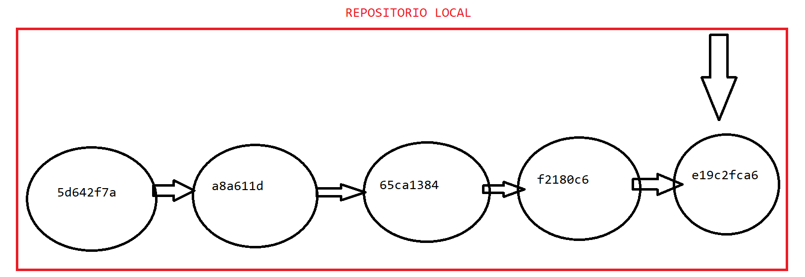

# GIT

## Introducción

Los sistemas de gestión de versiones de código fuente son herramientas que nos permiten trabajar en equipo en el desarrollo software y mantener un histórico de versiones del proyecto en el que se trabaja.

<b>Git</b> es un software de control de versiones diseñado por **Linus Torvalds**, pensando en la eficiencia, la confiabilidad y compatibilidad del mantenimiento de versiones de aplicaciones cuando estas tienen un gran número de archivos de código fuente. Su propósito es llevar registro de los cambios en archivos de computadora incluyendo coordinar el trabajo que varias personas realizan sobre archivos compartidos en un repositorio de código.

## Características más importantes

1. Gestión distribuida. Los programadores tendrán un repositorio local con el que trabajar y un repositorio remoto en el que se compartirán los cambios. Los programadores tendrán copias del repositorio remoto en el repositorio local. Estos aportan 2 grandes ventajas:

    - Puedes seguir trabajando, aunque el repositorio remoto esté caído
    - La información está más replicada.

2. Libre y de código abierto. Git es un software libre bajo la licencia de código abierto GPL. Además de estar disponible libremente en Internet, Git puede ser usado sin tener que pagar. El código puede ser descargado y modificado si es necesario.

3. Rápido y pequeño. Git no se basa en un servidor central, por eso no hay necesidad de interactuar con el servidor remoto para cada operación. Además está construido en lenguaje C y es muy liviano.

4. Ramificación sencilla. Una rama es un flujo de trabajo y sirven para hacer desarrollos
paralelos a nuestro trabajo principal. Las ramas en un repositorio Git se manejas de una forma sencilla comparadas con otros sistemas de control de versiones.

## Descarga e instalación

Lo primero que tenemos que hacer es descargar **Git** en nuestro ordenador e instalarlo. Esto varía en función del sistema operativo. Podemos descargarlo a partir del siguiente enlace [https://git-scm.com/downloads](https://git-scm.com/downloads).

Para instalarlo podemos elegir la configuración por defecto que se nos muestra en el instalador.

Una vez instalado, podemos ejecutar el siguiente comando en una terminal para verificar la instalación y ver la versión de GIT que estamos usando en nuestro ordenador.

    git --version

Git se puede trabajar perfectamente con una terminal o línea de comandos, aunque también es posible usar con algunas herramientas graficas.

## Flujo de trabajo

Es muy importante entender el flujo de trabajo de Git para poder trabajar con él. Tenemos 3 secciones de trabajo (tambien llamados arboles) dentro de un proyecto Git, a la que podremos añadirle una cuarta en caso de que queramos trabajar de manera colaborativa (siendo opcional).

1. **Directorio de trabajo o WorkSpace**. La carpeta que contiene los ficheros con los que vamos a trabajar. Estos archivos se sacan de la base de datos comprimida en el repositorio local, y se colocan en disco para que los puedas usar o modificar.
2. **Stage, area de preparación o Index**. Zona intermedia entre el workspace y el repositorio local. Es aquí donde vamos a poner los ficheros que están en nuestro workspace que queremos versionar en nuestra próxima confirmación.
3. **Repositorio local o directorio de Git**. Es donde se almacenan los metadatos y la base de datos de tu proyecto. Es la parte más importante de Git, y es lo que se copia cuando clonas un repositorio remoto.
4. **Repositorio remoto**. El concepto es prácticamente igual que el de repositorio local, pero es donde se persistirá la información de todos los repositorios locales de nuestro proyecto.

En la siguiente imagen podemos ver estas secciones

Un flujo de trabajo básico en Git sería:

1. Modificas una serie de archivos en tu directorio de trabajo.
2. Preparas los archivos, añadiéndolos a tu área de preparación (stage).
3. Confirmas los cambios, lo que toma los archivos tal y como están en el stage y almacena esa copia instantánea de manera permanente en tu directorio de Git o repositorio local.
4. (Opcional) Subimos los cambios de nuestro repositorio local a nuestro repositorio remoto.

## Configuración inicial

Debemos de configurar nuestro GIT con nuestro nombre de usuario y nuestro email

~~~
git config --global user.name "NOMBRE QUE USAREMOS PARA MOSTRAR EN GIT"
~~~

~~~
git config --global user.email "correo@electronico.es"
~~~

## Creación del directorio de trabajo o workspace

Una vez instalado y configurado nuestro Git debemos de crear el workspace donde queremos trabajar, pudiendo ser un directorio vacío o un workspace de algún IDE como Eclipse.

Una vez creado dicho workspace debemos de abrir una terminal de o ventana de comandos para empezar a ejecutar los comandos Git.

En nuestro caso, este workspace esta creado con Eclipse, pero podríamos haber usado cualquier IDE.

## Comandos básicos

1. Para crear un repositorio local GIT debemos de usar el siguiente comando en un workspace
 
        git init
    
    Este comando nos creara una carpeta oculta llamada <b>.git</b>. Dentro de esta carpeta estará nuestro repositorio local de GIT

    En caso de que queramos eliminar nuestro repositorio local, simplemente borraremos la carpeta <b>.git</b>

2. Para ver el estado de nuestro espacio de trabajo podemos usar el comando

        git status

    Que nos dará información sobre el estado de nuestras secciones, como por ejemplo, que archivos tenemos en el <b>stage</b> y cuáles no, o que archivos tenemos pendientes de hacer un commit. Es un comando muy usado.

3. Para añadir ficheros al <b>stage</B>

        git add nombre_fichero

    También podemos añadir todos los ficheros al stage de una manera más cómoda sustituyendo el nombre del fichero por un punto.

            git add .

    Para quitar ficheros del <b>stage</b> 

        git restore --staged NOMBRE_FICHERO

4. Para versionar los cambios que están en el stage

        git commit
    
    Todos los commits que se hagan tienen que tener un mensaje, por lo tanto, es más común utilizar el comando

        git commit -m "DESCRIPCION DEL COMMIT". 
    
    Todos los commits estan asociados a un usuario con un correo.

5. Podemos ver todo nuestro historial de cambios con el comando
    
        git log
    
    Que nos sacaria algo parecido a este mensaje:

        commit 5d642f7a2350ee19dc13bc2de94a96005c635ab1
        Author: Felix de Pablo <f.depablo.lobo@gmail.com>
        Date:   Sun Jan 23 21:35:52 2022 +0100

            Primer commit del proyecto

    Donde podemos ver el mensaje hash del commit (un identificador único del commit), el autor que ha realizado el commmit, la fecha en la que realizo el commit y el mensaje con el que se hizo el commit.

    <b>git log</b> nos saca todos los commits realizados, si pulsamos las flechas arriba y abajo de nuestro teclado podemos ir viendo el histórico. Si queremos cerrar el log debemos de pulsar la tecla <b>q</b>

6. Podemos ver los cambios de nuestro repositorio local con nuestro workspace con el comando
    
        git diff

7. Podemos eliminar los cambios nuevos de nuestro workspace con el comando 

        git restore NOMBRE_FICHERO 
    
    O si quieremos eliminar todos los cambios, poniendo <b>.</b>

        git restore .

8. Podemos ir a cualquier commit a ver la "foto" o estado de nuestro proyecto. Para ello usaremos el comando

        git checkout MENSAJE_HASH

    No hace falta poner todo el mensaje hash, con poner los primero caracteres es suficiente.

        git checkout 5d642f7a2350ee19dc13bc2de94a96005c635ab1
        git checkout 5d642f7

    De esta manera, <b>el workspace entero cambiara al estado en el que estaba el proyecto en el commit al que estamos apuntando</b>. Por supuesto, los demás commits no se perderán, por lo que podremos regresar en el momento que queramos. Podremos entender que nuestro repositorio local tiene registrados todos los commits de nuestro proyecto.

9. Cuando estamos en otro commit podemos usar el comando

        git log --all

    Con este comando podemos ver todos los commits del proyecto, ya que por defecto, el comando <b>git log</b> solo te muestra desde el commit al que estes apuntando hacia atras.

10. Para regresar al último commit de nuestra rama principal

        git checkout master

Tenemos que entender que por cada **commit** que hagamos sobre nuestro proyecto se nos persistirá el estado de nuestro proyecto en ese instante. Además, cada commit esta apuntando al siguiente commit que se hizo despues, teniendo una foto parecida a la siguiente.

## Ramas

11. Ramas, una rama es un flujo de trabajo, sirven para hacer desarrollos
paralelos a nuestro trabajo principal, sin necesidad de estropear los 
cambios en el desarrollo principal. Por defecto git trabaja sobre la rama
master, que sería la principal. Las ramas en git son punteros o referencias
que apuntan siempre al último commit de la rama a la que pertenecen. 
Podemos entender los commit como los objetos en java (poo), los commits 
son los que guardan las diferentes versiones o estados de nuestro repositorio. 
Podemos entenderlo tambien como fotos de nuestro repositorio.
Podemos crear ramas con el comando -> git checkout -b nombre_rama

12. podemos ver las ramas que tenemos con -> git branch

    - Podemos empezar a hacer desarrollos y commits sobre la rama
    actual en la que hemos creado. Siempre que hagamos un commit avanza
    el puntero de la rama con la que estamos trabajando y el puntero HEAD

13. Podemos fusionar ramas ýendonos a la rama donde queremos hacer la
fusion, y luego ejecutar el comando -> git merge rama_a_fusionar
por ejemplo, podemos ir a master y ejecutar git merge videojuegos

Cuando fusionarmos ramas puede haber conflictos en caso de que varias 
personas hayan estado trabajando con los mismos ficheros.

    - Para ver de manera grafica las ramas y los commits podemos
    ejecutar -> git log --graph --abbrev-commit --decorate --all

14. para borrar una rama (es un puntero o una referencia) se ejecuta
el comando -> git branch -d nombre_rama

15. Si queremos ver el detalle de los cambios que hicimos en un commit
podemos usar el comando -> git show codigo_sha1

16. Si creamos una nueva rama y trabajamos con cambios en un fichero y 
ese fichero no va a ser usado por más ramas, no hay problema de hacer 
"merge" entre distintas ramas. ¡Pero ojo! si varias ramas se pisan sobre 
las mismas lineas del fichero, puede haber conflictos.

17. con el comando "Gitk" podemos hacernos una idea generica de nuestro
repositorio a nivel de commits, se nos abré un programita de git 
totalmente visual.

18. Cuando fusionamos dos ramas que han estado trabajando con el mismos
fichero, git por defecto fusiona todos los cambios de ambas ramas. Luego
son los programadores los que deben decidir con que parte del codigo 
se quedan (¡puede ser todo!) y a continacion hacer un nuevo commmit

19. Si en algun caso no queremos versionar algun o algunos de los ficheros
que tenemos en un workspace podemos crear un fichero ".gitignore" y poner
ahi todos los ficheros que no quiero versionar. Este fichero va en el
directorio raiz de nuestro espacio de trabajo, y en principio, solo habra
un fichero .gitignore
Ejemplo de ".gitignore" de ignarar archivos de entorno de eclipse que no
tiene sentido compartir con otros compañeros de equipo (o nosotros):
https://github.com/fdepablo/WorkspaceJava/blob/master/.gitignore

20. Para trabajar en un entorno colaborativo debemos de usar un repositorio
remoto, por ejemplo, Github. Debemos de crear una cuenta y a continuacion
un repositorio. Una vez creado el repositorio en github, nos da una serie
de instrucciones para unirlo con un repositorio local:
Ej: git remote add origin https://github.com/fdepablo/WsEntornosDesarrolloTelefonica.git
remote add -> comando para decir a git que queremos contectarnos a un 
    repositorio remoto
origin -> es el nombre (alias) por defecto que le da git a nuestro repositorio 
    remoto
http://git... -> la direccion de nuestro repositorio remoto

21. Para subir cambios de nuestro repositorio local a nuestro repositorio
remoto usaremos el comando -> git push -u origin master
push -> subida al repo remoto
origin -> el nombre del repositorio remoto donde lo subimos
master -> nombre de la rama que queremos subir 
-u -> recordatorio de que siempre que hagamos un push, por defecto sea
de master a origin. Es decir, a partir de este momento, todos los "git push"
que haga seran automáticamente de la rama "master" al repositorio "origin"

22. Una vez subido al repo remoto podemos empezar a trabajar con otros 
compañeros (o incluso con nostros en diferentes ordenadores).
Lo primero que hay que hacer es una clonacion del repositorio
comando -> git clone NOMBRE_REPOSITORIO
EJ: git clone https://github.com/fdepablo/WsEntornosDesarrolloTelefonica.git

23. Si queremos descarganos la ultima version (commits) del repositorio
podemos ejecutar el comando -> git pull.

    - OJO! en caso de que cambiemos un repositorio clonado, si hacemos
    un pull puede que no nos lo haga porque tengamos primero que hacer
    un commit sobre nuestro cambios, y luego resolver los posibles conflictos

24. Nadie podra trabajar con nuestro ws (es decir, hacer commits, pero si
clones o pulls) a no ser que le demos permiso. Para ello hay que ir 
a la parte de "settings" del workspace y add el usuario en "manage access".

25. Una de las mejores maneras de trabajar en un entorno colaborativo podría
ser que cada integrante trabaje sobre una rama propia, e ir fusionando sus
cambios con la rama master. Podriamos hacer los siguientes pasos:
    1) Cada integrante del equipo se crea un rama propia local
    Ej: git checkout -b felix_desarrollo
    2) El integrante hace el desarrollo previsto con su rama
    Ej: Hace los cambios y luego hace los commits que hagan falta
    git add .
    git commit -m "descripcion del cambio"
    3) Una vez que haya acabado de hacer el desarrolo y los commits con su
    rama, nos cambiamos a la rama master, y ahi nos bajamos los posibles
    cambios que hayan hecho los demas integrantes del equipo.
    Ej: git checkout master
        git pull 
    4) Fusionamos la rama master con nuestra rama particular para hacer
    un merge de los cambios
    Ej: git merge felix_desarrollo
    5) Solucionar los posibles conflictos.
    6) Subir los cambios al repositorio remoto
    Ej: git push origin master
    7) Si queremos continuar con los desarrollos de nuestra rama, debemos de
    fusinar los cambios de la rama master con la rama nuestra de 
    desarrollo.
    Ej: git checkout felix_desarrollo
        git merge master
    8) Optativo, podriamos subir nuestra rama a origin para que la viesen
    otros integrantes del equipo. 
    Ej: git push origin felix_desarrollo

26. Otra manera de trabajar colaborativamente, es hacer un "fork" desde 
github a otro repositorio remoto para hacernos una copia exacta del 
repositorio al que estamos haciendo "fork", a partir de aqui nosotros
podremos desarrollar en nuestro repositorio los cambios que queramos.
En un momento dado podriamos solicitar un "pull request" al reposotorio
original con los cambios que estimemos oportunos. El dueño del repositorio
remoto orignal tendrá la ultima palabra sobre si acepta o no acepta el
"pull request" que le estamos solicitando.

## Bibliografia

### Documentación y tutoriales en inglés

- [Guia oficial en inglés](https://git-scm.com/book/en/v2)
- [https://danielkummer.github.io/git-flow-cheatsheet/](https://danielkummer.github.io/git-flow-cheatsheet/)
- [Flujo de trabajo en Git](https://dev.to/mollynem/git-github--workflow-fundamentals-5496)
- [Estado "detached" en Git](https://www.git-tower.com/learn/git/faq/detached-head-when-checkout-commit)

### Documentación y tutoriales en español

- [Guia oficial en español](https://git-scm.com/book/es/v2)
- [Tutorial rápido de Git](https://rogerdudler.github.io/git-guide/index.es.html)
- [https://www.atlassian.com/es/git/tutorials/learn-git-with-bitbucket-cloud](https://www.atlassian.com/es/git/tutorials/learn-git-with-bitbucket-cloud)
- [https://marklodato.github.io/visual-git-guide/index-es.html](https://marklodato.github.io/visual-git-guide/index-es.html)
- [Tutorial de ramas en Git](https://www.pragma.com.co/academia/lecciones/que-es-una-rama-de-git-y-como-crearlas)

### Tutoriales interactivos

- [https://learngitbranching.js.org/](https://learngitbranching.js.org/)
- [http://ndpsoftware.com/git-cheatsheet.html#loc=remote_repo;](http://ndpsoftware.com/git-cheatsheet.html#loc=remote_repo;)
- [https://gitimmersion.com/](https://gitimmersion.com/)
- [https://ohmygit.org/](https://ohmygit.org/)

### Videos

- [https://www.youtube.com/watch?v=QGKTdL7GG24&t=1486s](https://www.youtube.com/watch?v=QGKTdL7GG24&t=1486s)

### Cursos

- [Fundamentos de Git y GitHub](https://devcode.la/cursos/git/)
- [Curso en GitHub](https://github.com/oslugr/curso-git)

### Otros enlaces de interes

- [Herramientas visuales](https://git-scm.com/downloads/guis)
- [Guia rápida de markdown](http://warpedvisions.org/projects/markdown-cheat-sheet)

